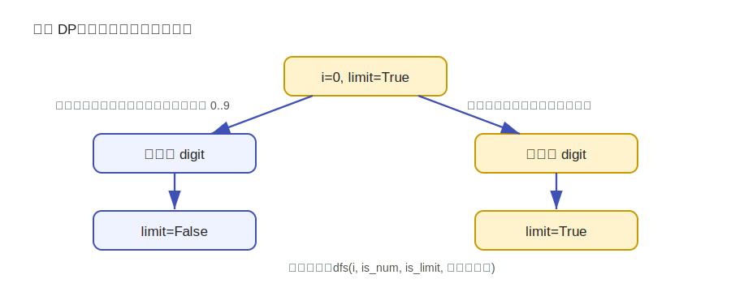

---
tags:
  - yyn
  - 算法模板
  - 动态规划
---

# 数位 DP

数位 DP 用于统计一个整数区间内满足某种性质的数字数量。典型形式是把数字按十进制位拆开，从高位到低位递归枚举。

常见问题：

- 统计 \([L,R]\) 中不含某个数字的数；
- 统计数字和满足条件的数；
- 统计相邻数位不相同的数；
- 统计二进制中 1 的个数满足条件的数。

## 基本套路

如果要统计 \([L,R]\)，通常转成前缀函数：

\[
ans(L,R)=F(R)-F(L-1)
\]

其中 \(F(x)\) 表示 \([0,x]\) 中满足条件的数字数量。

接下来只需要设计一个函数统计不超过上界 \(x\) 的合法数。

## 常见状态

设上界数字为字符串或数组 \(s\)。常见递归状态为：

\[
dfs(i, is\_num, is\_limit, state)
\]

含义如下：

| 参数 | 含义 |
|---|---|
| \(i\) | 当前处理到第几位 |
| `is_num` | 前面是否已经填过非前导零数字 |
| `is_limit` | 当前前缀是否贴着上界 |
| `state` | 题目需要维护的额外信息，例如数字和、上一位数字、模数余数等 |

<figure class="algo-figure" markdown>

<figcaption>图 1：如果当前位填了比上界小的数字，后续位就不再受上界限制。</figcaption>
</figure>

## 上界限制

如果 `is_limit=True`，当前位最大只能填上界对应位：

\[
up=s[i]
\]

否则可以填到 9：

\[
up=9
\]

当当前位填入 \(d\) 后，下一位是否仍然受限制取决于：

\[
is\_limit' = is\_limit \land (d=up)
\]

## 模板代码

下面模板保留了 `is_num`，用于处理前导零。如果题目中数字 0 也需要统计，可以根据题意单独处理。

```python
from functools import lru_cache

def count_leq(x: int) -> int:
    """统计 [0, x] 中满足条件的数的个数。"""
    if x < 0:
        return 0

    s = list(map(int, str(x)))
    n = len(s)

    @lru_cache(None)
    def dfs(i: int, is_num: bool, is_limit: bool, state: int) -> int:
        """
        i: 当前处理的位置
        is_num: 前面是否已经填过数字
        is_limit: 是否受到上界限制
        state: 根据题意维护的状态，这里只是占位
        """
        if i == n:
            # 根据题意判断 state 是否合法
            return int(is_num and state == 0)

        res = 0

        # 可以跳过当前位置，继续保持前导零状态
        if not is_num:
            res += dfs(i + 1, False, False, state)

        up = s[i] if is_limit else 9
        low = 0 if is_num else 1

        for d in range(low, up + 1):
            new_state = state  # 根据题意更新，例如 (state + d) % mod
            res += dfs(i + 1, True, is_limit and d == up, new_state)

        return res

    return dfs(0, False, True, 0)

def solve(L: int, R: int) -> int:
    return count_leq(R) - count_leq(L - 1)
```

## 例：统计数字和是 3 的倍数的正整数

令 `state` 表示当前数字和对 3 取模的结果：

\[
state = (\text{digit sum}) \bmod 3
\]

每填一位 \(d\)，状态变为：

\[
state'=(state+d)\bmod 3
\]

最终要求：

\[
state=0
\]

```python
from functools import lru_cache

def count_sum_mod3(x: int) -> int:
    if x <= 0:
        return 0

    s = list(map(int, str(x)))
    n = len(s)

    @lru_cache(None)
    def dfs(i, is_num, is_limit, mod):
        if i == n:
            return int(is_num and mod == 0)

        res = 0
        if not is_num:
            res += dfs(i + 1, False, False, mod)

        up = s[i] if is_limit else 9
        low = 0 if is_num else 1
        for d in range(low, up + 1):
            res += dfs(i + 1, True, is_limit and d == up, (mod + d) % 3)
        return res

    return dfs(0, False, True, 0)

L, R = 1, 100
print(count_sum_mod3(R) - count_sum_mod3(L - 1))
```

## 记忆化条件

在实际优化中，只有当 `is_limit=False` 时，状态才可以被大量复用。Python 的 `@lru_cache` 会把所有参数一起缓存，写起来方便；如果要进一步优化，可以手动只缓存不受上界限制的状态。

## 复杂度

如果位数为 \(D\)，额外状态数量为 \(S\)，每一位枚举 10 个数字，则复杂度通常为：

\[
O(D\times S\times 10)
\]

对于十进制整数，\(D\) 通常很小，例如 \(10^{18}\) 也只有 19 位。

## 易错点

!!! warning "常见错误"
    - 忘记用 \(F(R)-F(L-1)\) 处理区间。
    - 前导零是否算作数字没有想清楚。
    - `is_limit and d == up` 写错。
    - 状态里漏掉“上一位数字”等必要信息。
    - 递归终点没有根据题意判断合法性。
