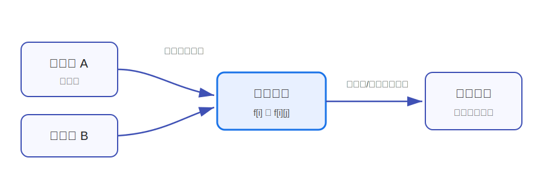

---
tags:
  - yyn
  - 算法模板
  - 动态规划
---

# 动态规划总览

动态规划（Dynamic Programming，简称 DP）用于处理一类具有**重叠子问题**和**最优子结构**的问题。它的核心不是“套模板”，而是把一个大问题拆成若干可以复用的小问题，并规定好这些小问题之间的转移关系。

一个 DP 解法通常由四部分组成。

**状态**：用数组或函数表示一个子问题，例如 \(f[i]\)、\(f[i][j]\)。状态定义要尽量具体，最好能直接读出“这个值表示什么”。

**转移**：说明当前状态如何由更小的状态推出。例如在线性 DP 中，可能有：

\[
f[i]=\max(f[i-1], f[i-2]+a_i)
\]

**边界**：没有依赖的初始状态，例如 \(f[0]=0\)。边界写错时，后面的转移往往都会被污染。

**答案**：最终要读取的状态，例如 \(f[n]\) 或 \(\max_i f[i]\)。有些题并不是最后一个状态就是答案，例如 LIS 的答案是所有结尾状态的最大值。

<figure class="algo-figure" markdown>

<figcaption>图 1：DP 的本质是按照依赖顺序，用已知子问题推出当前状态。</figcaption>
</figure>

## 什么时候考虑 DP

如果题目具有以下特征，可以优先考虑 DP：

- 问题要求最大值、最小值、方案数或可行性；
- 暴力搜索会反复计算相同子问题；
- 当前选择会影响后续状态，但影响可以用少量变量概括；
- 可以设计出“前 \(i\) 个”“区间 \([l,r]\)”“以 \(u\) 为根的子树”“填到第 \(i\) 位”这类子问题。

!!! tip "DP 的思考顺序"
    先不要急着写代码。建议按下面四问思考：

    1. 当前子问题是什么？
    2. 当前状态由哪些更小状态转移而来？
    3. 初始状态是什么？
    4. 枚举顺序是否保证依赖已经算出？

## 常见状态类型

- **线性 DP**：常见状态为 \(f[i]\)、\(f[i][j]\)，适合 LIS、LCS、路径计数等问题。
- **背包 DP**：常见状态为 \(f[i][j]\)、\(f[j]\)，适合容量限制下的最优选择问题。
- **区间 DP**：常见状态为 \(f[l][r]\)，适合石子合并、括号匹配、回文区间等问题。
- **树形 DP**：常见状态为 \(f[u]\)、\(f[u][k]\)，适合子树统计和树上选择问题。
- **数位 DP**：常见状态为 \(dfs(i, limit, \ldots)\)，适合统计 \([L,R]\) 中满足条件的数。

## 经典例题索引

本栏每个小节都给出一个或多个经典例题，并使用 Python 模板代码实现。

| 小节 | 经典例题 | 主要状态 |
|---|---|---|
| 简单 DP | LIS、LCS | 位置、前缀 |
| 背包 DP | 0-1 背包、完全背包、多重背包 | 物品编号、容量 |
| 区间 DP | 石子合并 | 区间左右端点 |
| 树形 DP | 没有上司的舞会、树的直径 | 节点、子树状态 |
| 数位 DP | 数字和取模统计 | 数位位置、限制、状态 |

## 复杂度估计

DP 的时间复杂度通常可以粗略估计为：

\[
\text{时间复杂度}=\text{状态数}\times\text{每个状态的转移次数}
\]

例如 0-1 背包有 \(n\) 个物品、容量为 \(W\)，状态数为 \(O(nW)\)，每个状态只需考虑选或不选，因此时间复杂度为 \(O(nW)\)。

## 易错点

!!! warning "常见错误"
    - 状态定义含糊，导致转移式写不出来。
    - 一维优化时枚举方向写反，例如 0-1 背包应倒序，完全背包应正序。
    - 边界状态没有初始化。
    - 答案位置读错，例如 LIS 的答案是 \(\max_i f[i]\)，不一定是 \(f[n]\)。
    - 递归记忆化没有正确处理非法状态。

## 本栏内容

- [简单 DP](simple-dp.md)：LIS、LCS 等线性状态转移。
- [背包 DP](knapsack-dp.md)：0-1 背包、完全背包、多重背包。
- [区间 DP](interval-dp.md)：按区间长度推进，枚举断点合并。
- [树形 DP](tree-dp.md)：在树上自底向上合并子树信息。
- [数位 DP](digit-dp.md)：按数字位统计区间内满足条件的数。
