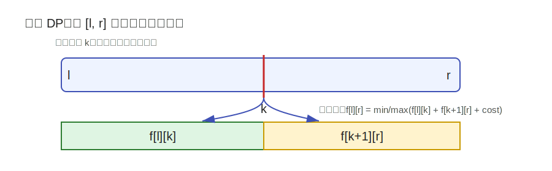

---
tags:
  - yyn
  - 算法模板
  - 动态规划
---

# 区间 DP

区间 DP 的状态通常定义在一个连续区间上，例如：

\[
f[l][r]
\]

表示区间 \([l,r]\) 的最优值、方案数或可行性。它常见于“把一个区间拆成两个子区间”或者“先处理内部，再处理两端”的问题。

## 适用场景

- 石子合并；
- 矩阵链乘法；
- 回文串相关问题；
- 括号匹配与区间消除；
- 区间上选择一个断点合并左右部分的问题。

## 基本思想

如果一个区间 \([l,r]\) 可以通过枚举中间断点 \(k\) 拆成两个子区间：

\[
[l,k] \quad \text{和} \quad [k+1,r]
\]

那么常见转移为：

\[
f[l][r]=\min_{l\le k<r}\{f[l][k]+f[k+1][r]+cost(l,k,r)\}
\]

或者把 `min` 换成 `max`，取决于题目要求。

<figure class="algo-figure" markdown>

<figcaption>图 1：区间 DP 常通过枚举断点，把大区间拆成两个已经计算的小区间。</figcaption>
</figure>

## 枚举顺序

区间 DP 必须保证计算 \(f[l][r]\) 时，所有更短区间已经算好。因此常见写法是按区间长度枚举：

```python
n = 10
INF = float('inf')
f = [[0] * n for _ in range(n)]

# length 表示区间长度
for length in range(2, n + 1):
    for l in range(0, n - length + 1):
        r = l + length - 1
        f[l][r] = INF
        for k in range(l, r):
            cost = 0  # 根据题目修改
            f[l][r] = min(f[l][r], f[l][k] + f[k + 1][r] + cost)

print(f[0][n - 1])
```

也可以用从右向左枚举左端点的方式：

```python
n = 10
INF = float('inf')
f = [[0] * n for _ in range(n)]

for l in range(n - 1, -1, -1):
    for r in range(l + 1, n):
        f[l][r] = INF
        for k in range(l, r):
            cost = 0
            f[l][r] = min(f[l][r], f[l][k] + f[k + 1][r] + cost)
```

## 记忆化搜索写法

区间 DP 的递归形式通常更接近“定义”：

```python
from functools import lru_cache

INF = float('inf')
n = 10

@lru_cache(None)
def dfs(l, r):
    if l == r:
        return 0
    res = INF
    for k in range(l, r):
        cost = 0  # 根据题目修改
        res = min(res, dfs(l, k) + dfs(k + 1, r) + cost)
    return res

print(dfs(0, n - 1))
```

## 区间消除类问题

对于括号匹配、字符串消除一类问题，除了枚举断点，还可能有“两端匹配”的转移。

例如，如果 \(s_l\) 和 \(s_r\) 可以配对，并且中间 \([l+1,r-1]\) 可以完全消除，则：

\[
f[l][r] \leftarrow f[l+1][r-1]
\]

如果一个区间可以拆成两段分别消除，则：

\[
f[l][r] \leftarrow f[l][k] \land f[k+1][r]
\]

这类问题要特别注意区间长度的奇偶性，因为一次消除两个字符时，能完全消除的区间长度通常是偶数。

## 复杂度

若区间长度为 \(n\)，状态有 \(O(n^2)\) 个。每个状态枚举一个断点 \(k\)，转移 \(O(n)\)。

\[
\text{时间复杂度}=O(n^3),\qquad \text{空间复杂度}=O(n^2)
\]

## 易错点

!!! warning "常见错误"
    - 先枚举左右端点，导致依赖的小区间还没算出。
    - 边界状态没有设好，例如 \(f[i][i]\) 或空区间。
    - 断点范围写错，通常是 \(l\le k<r\)。
    - `cost(l,k,r)` 与区间前缀和有关时，忘记提前预处理。
