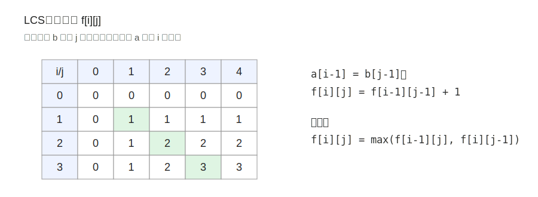

---
tags:
  - yyn
  - 算法模板
  - 动态规划
---

# 简单 DP

简单 DP 通常指状态维度较低、转移关系比较直接的一类动态规划。常见形式是“处理到第 \(i\) 个位置”或“处理两个序列的前缀”。

!!! note "本页目标"
    通过 LIS 和 LCS 两个经典问题理解线性 DP 的状态设计方式。

## 最长上升子序列 LIS

给定长度为 \(n\) 的序列 \(a_1,a_2,\dots,a_n\)，求一个最长的严格上升子序列长度。子序列不要求连续，但相对顺序不能改变。

例如：

\[
[1,4,2,2,5,6]
\]

一个最长上升子序列可以是 \([1,2,5,6]\)，长度为 \(4\)。

### 二次复杂度 DP 解法

设：

\[
f[i] = \text{以 } a_i \text{ 结尾的最长上升子序列长度}
\]

如果 \(j<i\) 且 \(a_j<a_i\)，那么可以把 \(a_i\) 接在以 \(a_j\) 结尾的上升子序列后面：

\[
f[i] = \max_{j<i,\ a_j<a_i}(f[j]+1)
\]

边界为：

\[
f[i]=1
\]

因为只选 \(a_i\) 自己也能形成长度为 \(1\) 的上升子序列。

答案是：

\[
\max_{1\le i\le n} f[i]
\]

```python
n = 6
a = [1, 4, 2, 2, 5, 6]

# 下标从 1 开始更方便写状态
arr = [0] + a
f = [0] + [1] * n

for i in range(1, n + 1):
    for j in range(1, i):
        if arr[j] < arr[i]:
            f[i] = max(f[i], f[j] + 1)

print(max(f))  # 4
```

### 贪心加二分优化

维护数组 \(g\)，其中：

\[
g[k] = \text{长度为 } k+1 \text{ 的上升子序列的最小结尾值}
\]

结尾值越小，越容易接上后面的数，所以当遇到一个新数 \(x\) 时，用二分找到第一个 \(\ge x\) 的位置并替换它。

下面用一个手动轮播图演示序列 `[1, 4, 2, 2, 5, 6]` 的处理过程。图中的 `g` 数组不一定是真实子序列，但它记录了每种长度下最优的最小结尾。

<div class="yyn-carousel" tabindex="0" aria-label="LIS 贪心加二分过程手动轮播">
  <div class="yyn-carousel-viewport">
    <div class="yyn-carousel-slide" data-caption="第 1 步：g 为空，直接追加 1。"></div>
    <div class="yyn-carousel-slide" data-caption="第 2 步：4 大于所有结尾，追加到 g 末尾。"></div>
    <div class="yyn-carousel-slide" data-caption="第 3 步：用 2 替换原来的 4，使长度为 2 的子序列结尾更小。"></div>
    <div class="yyn-carousel-slide" data-caption="第 4 步：再次遇到 2，替换后 g 不变。"></div>
    <div class="yyn-carousel-slide" data-caption="第 5 步：5 大于所有结尾，追加到 g 末尾。"></div>
    <div class="yyn-carousel-slide" data-caption="第 6 步：6 继续扩展，最终 LIS 长度为 4。"></div>
  </div>
  <div class="yyn-carousel-toolbar">
    <button class="yyn-carousel-prev" type="button" aria-label="上一张">‹</button>
    <span class="yyn-carousel-counter" aria-live="polite">1 / 6</span>
    <button class="yyn-carousel-next" type="button" aria-label="下一张">›</button>
  </div>
  <div class="yyn-carousel-caption">第 1 步：g 为空，直接追加 1。</div>
</div>

```python
from bisect import bisect_left

n = 6
a = [1, 4, 2, 2, 5, 6]

g = []
for x in a:
    idx = bisect_left(g, x)  # 严格上升：找第一个 >= x 的位置
    if idx == len(g):
        g.append(x)
    else:
        g[idx] = x

print(len(g))  # 4
```

!!! tip "严格上升与非严格上升"
    - 严格上升：使用 `bisect_left`，即替换第一个 `>= x` 的位置。
    - 非严格上升：使用 `bisect_right`，即替换第一个 `> x` 的位置。

### 复杂度

| 解法 | 时间复杂度 | 空间复杂度 |
|---|---:|---:|
| 经典 DP | \(O(n^2)\) | \(O(n)\) |
| 贪心 + 二分 | \(O(n\log n)\) | \(O(n)\) |

## 最长公共子序列 LCS

给定两个序列 \(a\)、\(b\)，求二者的最长公共子序列长度。公共子序列同样不要求连续，但要保持相对顺序。

设：

\[
f[i][j] = a \text{ 的前 } i \text{ 个元素与 } b \text{ 的前 } j \text{ 个元素的 LCS 长度}
\]

当 \(a_i=b_j\) 时，两个元素可以一起选：

\[
f[i][j]=f[i-1][j-1]+1
\]

否则，只能跳过其中一个结尾：

\[
f[i][j]=\max(f[i-1][j], f[i][j-1])
\]

<figure class="algo-figure" markdown>

<figcaption>图 1：LCS 常用二维表推进，每个格子依赖左、上、左上三个方向。</figcaption>
</figure>

```python
a = [1, 2, 3, 4, 5]
b = [2, 3, 2, 1, 4, 5]
n, m = len(a), len(b)

f = [[0] * (m + 1) for _ in range(n + 1)]

for i in range(n):
    for j in range(m):
        if a[i] == b[j]:
            f[i + 1][j + 1] = f[i][j] + 1
        else:
            f[i + 1][j + 1] = max(f[i][j + 1], f[i + 1][j])

print(f[n][m])
```

也可以写成记忆化搜索：

```python
from functools import lru_cache

@lru_cache(None)
def dfs(i, j):
    # a[0..i] 与 b[0..j] 的 LCS
    if i < 0 or j < 0:
        return 0
    if a[i] == b[j]:
        return dfs(i - 1, j - 1) + 1
    return max(dfs(i - 1, j), dfs(i, j - 1))

print(dfs(n - 1, m - 1))
```

## 小结

简单 DP 的关键是确定“当前状态的最后一步”。

- LIS：最后一个选中的元素是谁。
- LCS：两个前缀的最后一个元素是否匹配。

只要最后一步拆清楚，状态转移就会自然出现。
