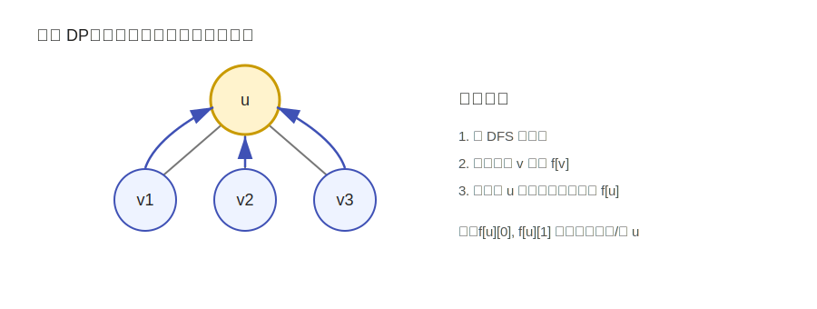

---
tags:
  - yyn
  - 算法模板
  - 动态规划
---

# 树形 DP

树形 DP 是在树结构上进行的动态规划。由于树没有环，一个节点的不同子树之间天然相互独立，因此很多问题可以先计算子节点，再把子节点的信息合并到父节点。

## 基本思想

树形 DP 通常以某个节点 \(u\) 为根，定义：

\[
f[u] = \text{以 } u \text{ 为根的子树中的答案}
\]

如果状态需要区分选择情况，也可以写成：

\[
f[u][0],\ f[u][1]
\]

例如：

- \(f[u][0]\)：不选节点 \(u\) 时，\(u\) 子树内的最优值；
- \(f[u][1]\)：选节点 \(u\) 时，\(u\) 子树内的最优值。

<figure class="algo-figure" markdown>

<figcaption>图 1：树形 DP 常在 DFS 回溯阶段把孩子的状态合并到父节点。</figcaption>
</figure>

## 经典例题一：没有上司的舞会

!!! example "例题：没有上司的舞会模型"
    给定一棵树，每个节点有一个快乐值。选择若干个节点参加舞会，要求任意父子节点不能同时被选，求最大快乐值和。

这个问题的关键是：对每个节点 \(u\)，只需要考虑“选 \(u\)”和“不选 \(u\)”两种状态。

### 状态设计

设：

\[
f[u][0] = \text{不选 } u \text{ 时，} u \text{ 子树内的最大快乐值}
\]

\[
f[u][1] = \text{选 } u \text{ 时，} u \text{ 子树内的最大快乐值}
\]

如果选 \(u\)，那么它的所有孩子都不能选：

\[
f[u][1] = val[u] + \sum_{v\in son(u)} f[v][0]
\]

如果不选 \(u\)，那么每个孩子可选可不选，取较大值：

\[
f[u][0] = \sum_{v\in son(u)} \max(f[v][0], f[v][1])
\]

### 模板代码

```python
n = 5
val = [0, 3, 2, 1, 10, 1]  # 节点权值，1-indexed
edges = [(1, 2), (1, 3), (2, 4), (2, 5)]

g = [[] for _ in range(n + 1)]
for u, v in edges:
    g[u].append(v)
    g[v].append(u)

f = [[0, 0] for _ in range(n + 1)]

def dfs(u, fa):
    f[u][1] = val[u]
    for v in g[u]:
        if v == fa:
            continue
        dfs(v, u)
        f[u][0] += max(f[v][0], f[v][1])
        f[u][1] += f[v][0]

dfs(1, 0)
print(max(f[1][0], f[1][1]))
```

## 经典例题二：树的直径

!!! example "例题：树的直径"
    给定一棵无权树，求树上任意两个节点之间的最长简单路径长度。

这也是树形 DP 的经典问题。对每个节点 \(u\)，维护从 \(u\) 向下走到子树中的最长链长度。经过 \(u\) 的最长路径，可能由两个不同孩子子树中的最长链拼接而成。

### 状态设计

设：

\[
down[u] = \text{从 } u \text{ 出发向下走的最长链长度}
\]

当处理 \(u\) 的一个孩子 \(v\) 时，候选链长度为：

\[
down[v]+1
\]

如果当前节点有两条最长的向下链，长度分别为 \(mx_1\) 和 \(mx_2\)，那么经过 \(u\) 的最长路径长度为：

\[
mx_1+mx_2
\]

### 模板代码：递归求解

```python
n = 5
edges = [(1, 2), (1, 3), (2, 4), (2, 5)]

g = [[] for _ in range(n + 1)]
for u, v in edges:
    g[u].append(v)
    g[v].append(u)

ans = 0

def dfs(u, fa):
    """返回从 u 向下走的最长链长度。"""
    global ans
    mx = 0
    for v in g[u]:
        if v == fa:
            continue
        length = dfs(v, u) + 1
        ans = max(ans, mx + length)
        mx = max(mx, length)
    return mx

dfs(1, 0)
print(ans)
```

## 非递归处理方式

如果树很深，递归可能爆栈。可以先得到父子关系和遍历顺序，再逆序处理。

```python
n = 5
edges = [(1, 2), (1, 3), (2, 4), (2, 5)]

g = [[] for _ in range(n + 1)]
for u, v in edges:
    g[u].append(v)
    g[v].append(u)

parent = [0] * (n + 1)
order = [1]
parent[1] = -1

for u in order:
    for v in g[u]:
        if v == parent[u]:
            continue
        parent[v] = u
        order.append(v)

# down[u] 表示从 u 向下的最长链
# best[u] 表示从 u 向下的次长链
down = [0] * (n + 1)
best = [0] * (n + 1)
ans = 0

for u in reversed(order):
    for v in g[u]:
        if parent[v] != u:
            continue
        length = down[v] + 1
        ans = max(ans, down[u] + length)
        if length > down[u]:
            best[u] = down[u]
            down[u] = length
        elif length > best[u]:
            best[u] = length

print(ans)
```

## 易错点

!!! warning "树形 DP 常见错误"
    - 无向树 DFS 时忘记传父节点，导致在父子之间反复递归。
    - 状态合并写在 DFS 前序阶段，而不是子节点处理完成后的回溯阶段。
    - 根节点选择不影响树形 DP 的最终答案，但会影响父子方向，需要保持一致。
    - Python 中树很深时需要考虑递归深度限制或改用非递归写法。
